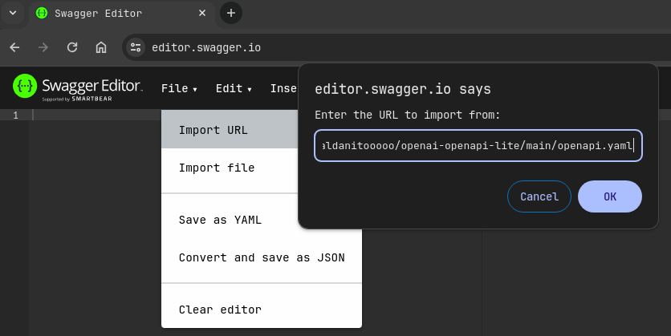
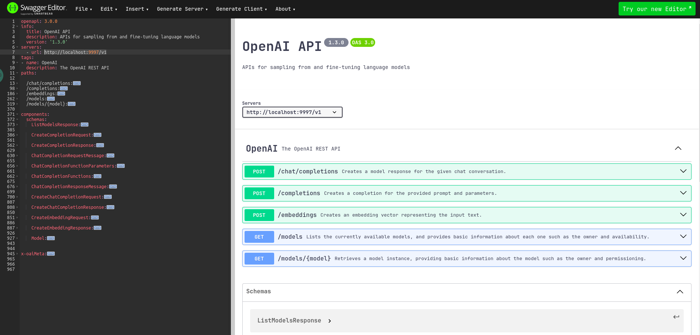

# openai-openapi-lite
A lightweight version of the OpenAI API's OpenAPI specification.

## 
When you deploy your LLMs locally, tools such as Xinference, FastChat, OpenLLM, and RayLLM provide OpenAI-Compatible RESTful APIs.

## Usage

### Step 1
Import https://raw.githubusercontent.com/Valdanitooooo/openai-openapi-lite/main/openapi.yaml into [Swagger Editor](https://editor.swagger.io/).

### Step 2
Modify the server url and then test your API.

